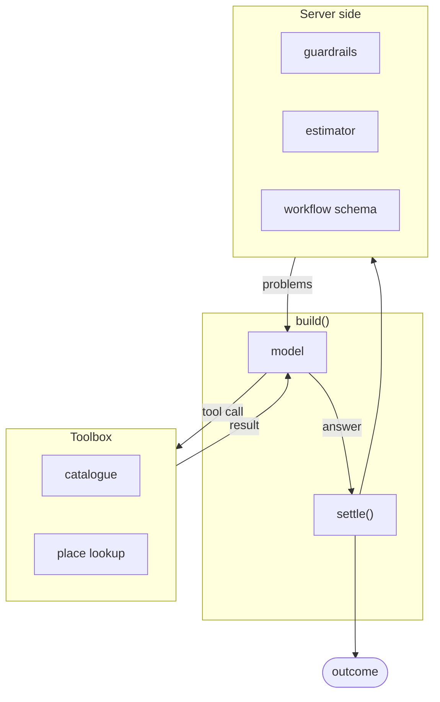
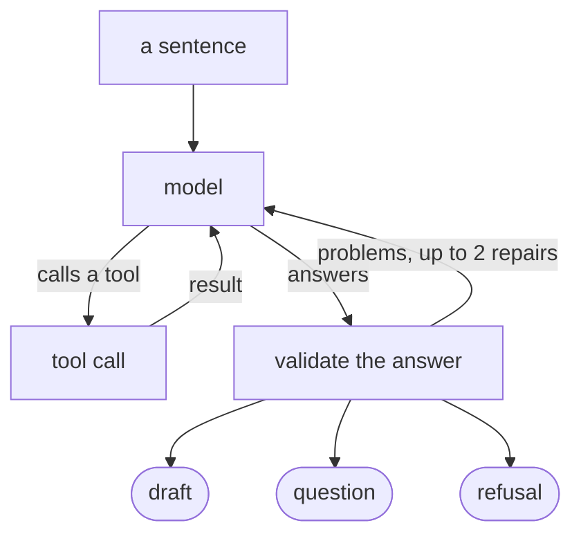

# AI engineering

The workflow builder turns a sentence into a draft workflow. The model is a 4B build quantised to
four bits, running on CPU in a container alongside the rest of the stack.

## The client

Everything that talks to a model goes through `backend/llm`. `Client` is a protocol with two
members, `chat()` and `identity()`, and the implementations wrap each other.

| Class          | Purpose                                                       |
| -------------- | ------------------------------------------------------------- |
| `OllamaClient` | The real thing, over Ollama's chat API                        |
| `TracedClient` | Records every call in `llm_calls`, failures included          |
| `CachedClient` | Replays a reply from disk when nothing about the call changed |
| `FakeClient`   | Scripted replies for tests                                    |

`identity()` returns the provider, the model and the sampling options. `CachedClient` puts it in the
cache key, so a run against a different model or temperature misses the cache.

Sampling is fixed at `temperature=0, seed=0`, so the same inputs produce the same replies.

### Tracing

Every call is a row in `llm_calls`: purpose, prompt version, token counts, duration, the request and
the reply. A call that failed gets a row too, with the error on it. Recording happens in its own
transaction. A database failure there is logged and swallowed, so a reply the model already gave is
never lost to a tracing error.

The stored request holds tool names only. Full definitions repeat on every call and would dominate
the table.

### Structured output

`ask_structured()` constrains a reply to a Pydantic model's JSON schema, then validates the result.
Constrained decoding fixes the shape of the reply. It cannot check that a slug exists or that a start
date falls before an end date, so the parsed reply is validated as well.

`every_field_required()` marks every property required in the schema the model is shown. Constrained
decoding lets a model omit optional fields, and this model omitted ones it was meant to fill in.

## Prompts

A prompt is a file under `backend/llm/prompts`. Its version is a hash of the text, `builder@dfb654fb`.
Editing the prompt changes the version, so a logged call or an eval result identifies the wording
used.

Prompts use `$placeholders`, since `{braces}` collide with the JSON they quote.

The builder's prompt is 41 lines. Most of it is filled in at render time from the registered
catalogue: the detectors and their descriptions, worked examples using real slugs, and calendar notes
for today's date. No detector is named in the file itself, so a deployment with different models gets
a prompt describing those.

## Agent architecture

`build()` in `backend/builder/agent.py` takes a conversation, a client, a catalogue and a place
source, and returns an outcome. Everything it depends on is an argument, which is how the eval
harness runs it against recorded fixtures instead of a live database.



The loop is split across four layers:

| Layer            | Who decides | What it may do                                        |
| ---------------- | ----------- | ----------------------------------------------------- |
| Model            | the model   | Ask for a tool, or answer                             |
| Toolbox          | the server  | Answer a tool call from the catalogue or the geocoder |
| `settle()`       | the server  | Accept, repair or refuse the answer                   |
| Schema and queue | the server  | Reject anything that still does not fit               |

### Tools

| Tool               | Returns                                         |
| ------------------ | ----------------------------------------------- |
| `list_models`      | The registered detectors and what they need     |
| `list_collections` | The collections compatible with a detector      |
| `find_place`       | Named matches, each behind an opaque `place_id` |
| `answer`           | The model's conclusion, as a tool call          |

Answering is itself a tool call, so there is a single exit from the loop. Some models put the answer
in the message body as JSON instead; `answer_in_text()` handles that.

`find_place` returns an opaque id such as `place_1`. Geometry stays on the server, which resolves the
id when it settles the answer. An id the toolbox never issued produces the problem `place_id
'place_2' isn't one that find_place returned`, and the model is asked to fix it.

The toolbox records every distinct place a lookup matched. If "Springfield" matched several and the
user never said which, `unasked_place_guess()` sends the draft back to be answered as a question,
even where the model took the first match and moved on.

### State

The agent keeps no state between calls. Two tables hold what persists:

- `builder_runs` holds the conversation, the steps so far and the outcome. Each step is written in its
  own short transaction, so the browser sees a checkpoint as it happens.
- `place_lookups` caches geocoder answers for 30 days, shared by every worker.

Given the same conversation, catalogue and recorded places, a run produces the same answer.

### Failure modes and what handles them

| Failure                                  | Handled by                                      |
| ---------------------------------------- | ----------------------------------------------- |
| Invalid JSON, or the wrong shape         | Constrained decoding, then Pydantic validation  |
| Skipped optional fields                  | `every_field_required()` on the schema          |
| A slug that does not exist               | `settle()`, sent back as a repair               |
| A place that matches several real places | Turned into a question naming the candidates    |
| A date the user never gave               | `unasked_time_guess()`, sent back as a question |
| An area or period beyond the guardrails  | Refusal with the numbers                        |
| A draft that would fill the disk         | The estimator, before the draft is offered      |
| The model looping without converging     | `MAX_ROUNDS = 10`, `MAX_REPAIRS = 2`            |
| The model server being down              | Retries in `OllamaClient`, then the job queue   |

## The agent loop



`settle()` checks the answer against the catalogue, the dates, the area guardrails and the storage
estimate. Anything wrong with it goes back as the tool's result for the model to fix. After
`MAX_REPAIRS = 2` the run ends as a refusal, and `MAX_ROUNDS = 10` bounds the loop.

Three checks catch answers that are well formed but wrong:

- A place name matching several real places becomes a question listing the candidates.
- Invented times, like a date the user never mentioned, are caught before they reach the form.
- A refusal about a place is reported at the area checkpoint, so the checklist shows where the run
  stopped.

## Evals

A suite in `evals/` pairs a dataset with code that runs and scores each case. Every run is saved as
JSON under `evals/results/` with the git revision, the client identity and the prompt versions.
`eval-compare` reads two of those files and prints the differences.

```sh
make eval SUITE=builder
make eval SUITE=builder ARGS="--tag quick"
make eval-compare SUITE=builder
```

The builder set is 63 cases: 33 that should produce a draft, 12 that should ask a question, 16 that
should be refused, and 2 where either answer is defensible.

Ten metrics, each between 0 and 1:

| Metric             | Asks                                                 |
| ------------------ | ---------------------------------------------------- |
| `kind`             | draft, question or refusal, as expected              |
| `valid`            | does the draft pass the same schema the API enforces |
| `mode`             | historical or recurring                              |
| `dates`            | start and end                                        |
| `area`             | at least 0.5 overlap with the expected bounding box  |
| `model`            | the right detector                                   |
| `collections`      | a non-empty subset of what is compatible             |
| `interval`         | the polling interval, for recurring workflows        |
| `asks_when_needed` | asked when the request really was ambiguous          |
| `asks_needlessly`  | asked when it had enough to draft, lower is better   |

`asks_needlessly` balances `asks_when_needed`, since an agent that asks a question every time scores
1.00 on the latter. `builder_always_asks` is that agent, run over the same cases as a baseline. It
scores 0.23 on `kind`.

### Making runs repeatable

Three inputs are pinned so runs stay comparable:

- **Today's date.** Pinned to 2026-09-14, so "until the end of October" means the same dates forever.
- **Place lookups.** 50 recorded Nominatim answers in `evals/fixtures/places`, replayed by
  `RecordedPlaces`, which matches a query by its words, the way the geocoder does.
- **The catalogue.** Recorded to `evals/fixtures/catalogue.json`, so a seeded database is not needed
  and a new detector does not silently change old results.

Replies are cached on disk by default, keyed on the client identity, the messages, the tools and the
schema. A rerun after a prompt change only pays for the cases whose prompt actually changed.
`--no-cache` skips the cache.

## What the numbers did

The model is `qwen3:4b-instruct-2507-q4_K_M`. The instruct build was chosen over the default, which
reasons at length before answering and costs minutes per call on a CPU.

| Run | `kind` | `valid` | `asks_when_needed` | What changed                                   |
| --- | ------ | ------- | ------------------ | ---------------------------------------------- |
| 1   | 0.07   | 0.00    | 0.00               | first run                                      |
| 2   | 0.50   | 0.71    | 0.00               | every answer field required in the schema      |
| 5   | 0.86   | 1.00    | 0.33               | worked examples in the prompt                  |
| 7   | 0.90   | 0.87    | 0.92               | a new prompt, and ambiguous places asked about |
| 9   | 0.93   | 1.00    | 0.83               | replaying places the way a geocoder matches    |
| 11  | 0.95   | 1.00    | 0.83               | retrying lookups from wordier queries          |

Targets were set before any of this ran: 0.85 on most metrics, 1.0 on `valid`, 0.80 on
`asks_when_needed`, at most 0.10 on `asks_needlessly`. The final run clears all of them, with 0
errors and a median of 54 seconds per case.

Runs 1 and 2 used the same prompt, `builder@168e50ac`. The gain between them came from the schema:
the model had been omitting optional fields, and marking them required stopped it.

## Notes

Ollama runs with `OLLAMA_NUM_PARALLEL: 1`. Each parallel slot reserves a whole context window of
memory, and on a CPU box that turns into swapping.

`CachedClient` is wired up only by the eval runner. Two people asking for the same workflow each get
their own draft.

`cannot` is a scored outcome. 16 of the 63 cases expect a refusal, for requests like counting cars,
where no registered detector fits.

`python -m llm check` asks the model for one word and records the call. It checks in one go that the
model is pulled, reachable from the worker, and being traced.
