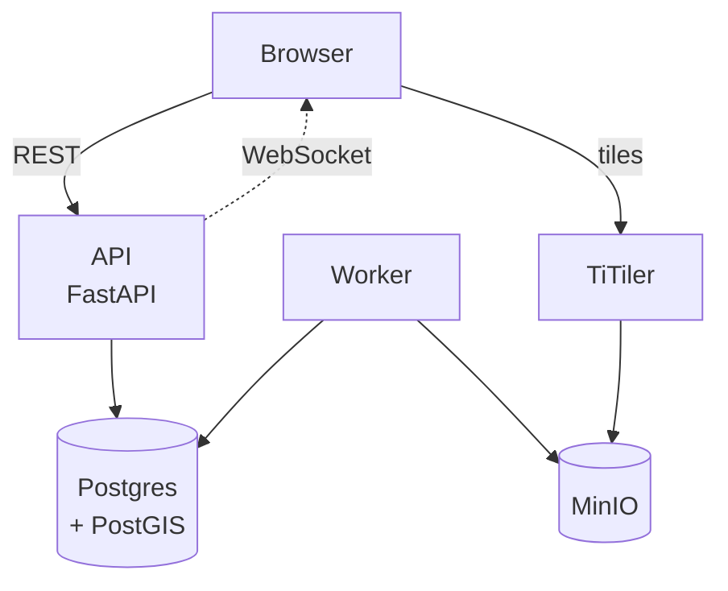
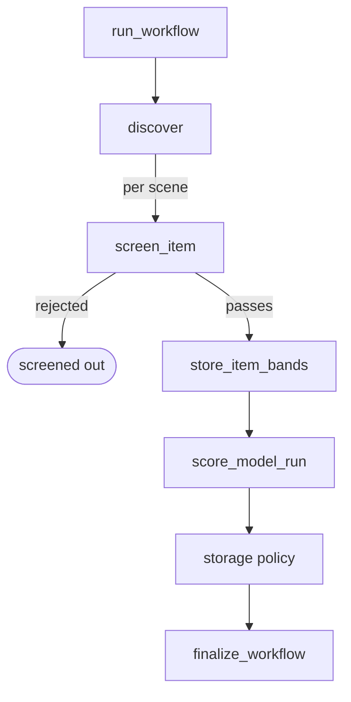

# Architecture

GeoTriage runs as seven containers. The API serves the frontend's requests and writes to Postgres.
The worker does the rest: searching archives, fetching imagery, running detectors and talking to the
language model.

## Services

| Service      | Role                                                                     |
| ------------ | ------------------------------------------------------------------------ |
| **API**      | Request handling, job enqueueing, and change notifications on `/live`    |
| **Worker**   | The pipeline, the workflow builder, and the scheduler                    |
| **Postgres** | Workflows, scenes, runs, scores, the registry, the STAC cache, the queue |
| **MinIO**    | Bands and maps kept by a workflow's storage policy                       |
| **TiTiler**  | Tiles for the browser, read from the COGs in MinIO                       |
| **Ollama**   | The language model used by the workflow builder                          |
| **Frontend** | Serves the built React app                                               |

The queue lives in Postgres, in three tables: `jobs`, `job_groups` for fan-in, and `recurring_jobs`
for scheduled work. There is no separate broker. A job carries its dependencies, a lease and an attempt count, so
an interrupted job is claimed again by the next worker that polls.

The worker is the only thing that reaches outside: STAC archives, Nominatim, Ollama and the detector
images. Detectors are run by `backend/runners/docker.py` with no network and the scene directory
mounted read only. Place lookups are cached in `place_lookups` for 30 days, shared by every worker.

## Running a workflow

| Task                | What it does                                                         |
| ------------------- | -------------------------------------------------------------------- |
| `discover`          | STAC search, and a `workflow_items` row per scene over the area      |
| `screen_item`       | Prefilter on coarse bands; a rejected scene is never fetched in full |
| `store_item_bands`  | Fetches the bands the enabled detectors need, into scratch           |
| `score_model_run`   | Runs one detector, writes its rasters and scores                     |
| storage policy      | Uploads the layers the policy keeps, deletes the rest                |
| `finalize_workflow` | Sets the final workflow status                                       |

Staging and scoring for a scene share a job group, whose completion hook enqueues
`finalize_workflow` once per workflow. Recurring workflows are enqueued by `check_due_workflows`.

## The workflow builder

`POST /builder/runs` enqueues a `build_draft` job and returns a run id. The worker loops with the
model until it has a draft, a question or a refusal, checking each answer against the catalogue, the
dates and the storage guardrails. Steps are written to `builder_runs.steps` as they happen, which is
what the checklist on the create page renders.

See [AI engineering](ai-engineering.md) for the agent, the prompts and the eval harness.

## Storage

See [Storage architecture](storage-architecture.md) for the two stores, the storage policies, and the
checks that stop a run filling the disk.
