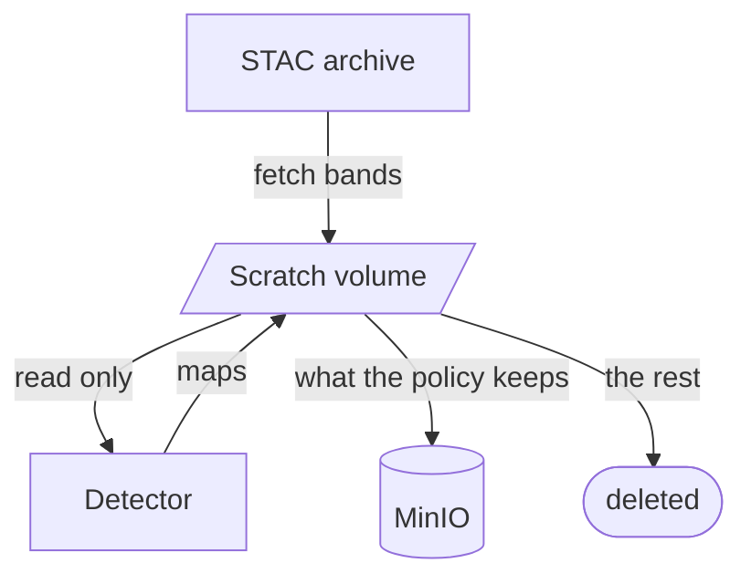
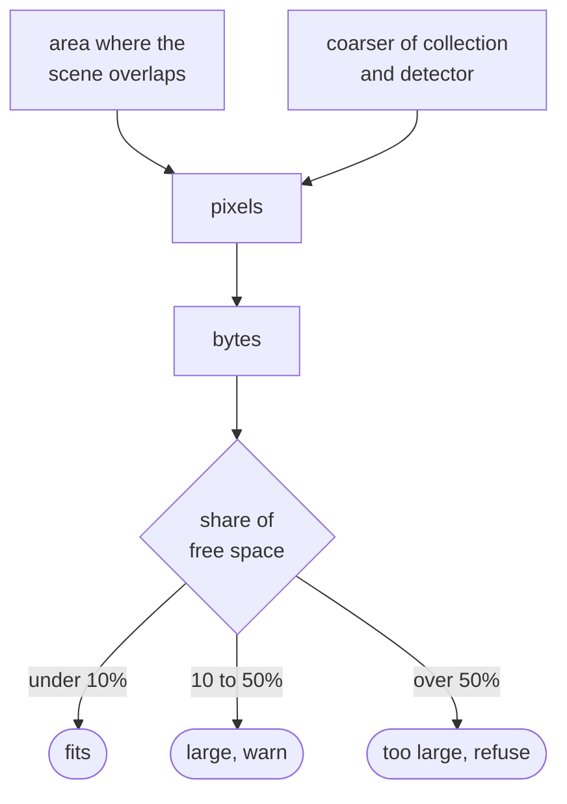

# Storage architecture

A workflow writes to two places: a scratch volume while it works, and MinIO for whatever it keeps.
Both are checked before a run downloads anything.

## The two stores

Bands are fetched into `scenes/<item_id>/bands/` on the scratch volume, and detectors write their
rasters to `scenes/<item_id>/maps/`. Once a scene is scored, the policy runs, the kept layers are uploaded to
`<workflow>/<item>/<layer>.tif`, and the scene directory is removed. Scenes that a workflow never
finished are picked up by `finalize_workflow`, and any folder left behind by a killed worker is swept
on the next worker start.

|                  | Scratch volume                        | MinIO                          |
| ---------------- | ------------------------------------- | ------------------------------ |
| Holds            | Every band of a scene being worked on | Only the layers a policy keeps |
| Lives for        | Minutes                               | Indefinitely                   |
| Runs out because | One large workflow is running now     | Many workflows have run before |

The two fill at different rates, so each is measured against its own free space. `free_bytes()` in
`backend/domain/storage.py` reads the scratch filesystem; the one in `backend/storage/client.py`
reads MinIO's cluster metrics.

## Storage policy

A workflow picks a policy when it is created. After a scene is scored, `imagery_to_keep()` combines
the policy with the scene's severity to decide what to upload.

| Policy                    | Imagery kept for | Maps        |
| ------------------------- | ---------------- | ----------- |
| Everything                | every scene      | every scene |
| Alert and Caution in full | Alert, Caution   | every scene |
| Alert in full             | Alert only       | every scene |
| Maps only                 | no scene         | every scene |
| Scores only               | no scene         | none        |

Scores are rows in `model_scores` and a policy never touches them; only rasters are at stake. The
result is written to `workflow_items.imagery_kept`, which the scene page reads to decide which layers
to offer, so it never links to a tile that was deleted.

## Three checks

The same arithmetic runs at three points.

| Moment             | Question                                | If it fails                                        |
| ------------------ | --------------------------------------- | -------------------------------------------------- |
| **Drafting**       | Would this draft fill the disk?         | The builder returns a refusal with the numbers     |
| **On the form**    | Has this exact form been estimated?     | Create is disabled until it has been               |
| **Start of a run** | Do the scenes actually found still fit? | `StorageLimitExceeded`, before anything is fetched |

The form's estimate is tied to the values it was made from and is cleared as soon as any of them
change. Recurring workflows are not estimated at all, since their scenes do not exist yet, so the
run-time check is the only one that applies to them. `check_storage()` in
`backend/pipeline/storage.py` tests both stores: the working bytes against scratch, and the bytes the
policy would keep against MinIO.

## Estimating a size

A scene is sized by the part of it that overlaps the area, at four bytes per pixel per raster, using
the coarser of the collection's resolution and the detector's declared GSD.

Counting stops once the total crosses the limit, since more scenes cannot change the verdict and
paging through thousands of them took minutes. A count that stopped early is reported as a minimum,
"at least 40 GB".
